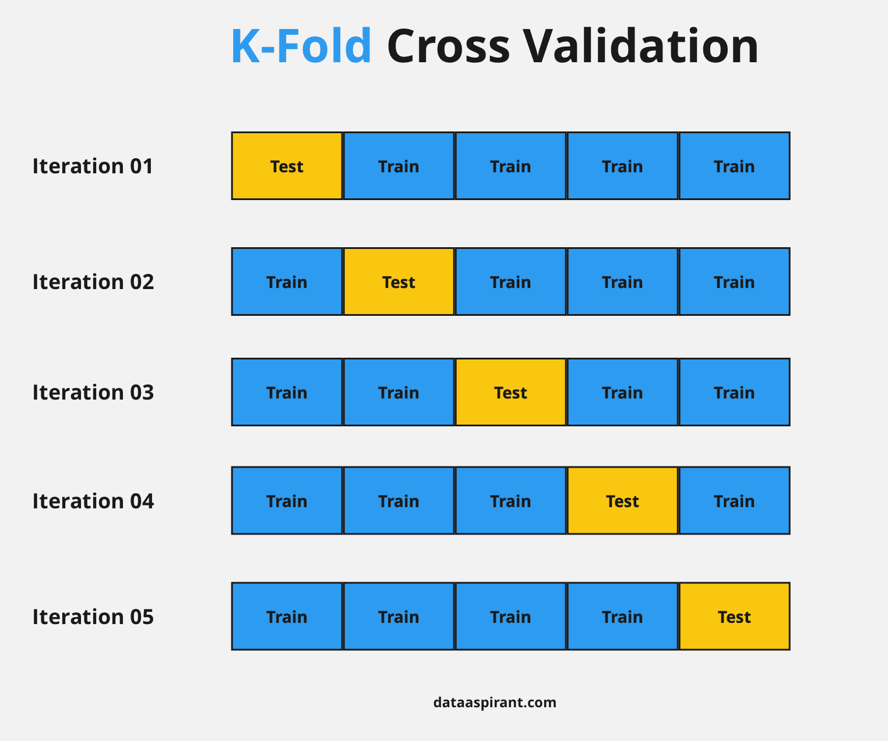

# Intro
**Description**:

This script selects a parsimonious, uncorrelated feature set. While RF is robust to collinearity, studies suggest it does better with an uncorrelated & parsimonious featureset.

I wanted to use a semi-manual selection process, rather than a fully-automated, because honestly *feature selection is part science and part art*. This script explains my process on a subset of my data (my data and featureset were hugggeeee – I had to run feature selection on a high performance computer).

**Inputs**:

Training data with a variable called "block", which divides my data into 9 spatio-temporal folds

**Steps**:

1.  run cross-validated recursive feature elimination (CV-RFE) to get the top feature


Link to mlr3 feature selection package, with more explanations: <https://mlr3fselect.mlr-org.com/>

{width="579"}

2.  remove all features that are \>0.88 correlated with the top feature
3.  run CV-RFE again to get the 2nd top feature
4.  remove features correlated with it
5.  etc etc until I've removed all pairwise correlations
6.  pick the top n features, stopping when performance gains from more features plateaus

**Outputs**: results of cv-rfe runs

# Setup
```{r, warning=F, message=F}
# Load packages
library(tidyverse)
library(data.table)
library(car)
library(mlr3spatiotempcv)
library(mlr3learners)
library(mlr3fselect)
library(mlr3pipelines)
library(parallelly)
library(future)
library(here)

# set number of cores to use to 3 out of my laptop's 8
parallelly::availableCores() 
w <- 3
```

```{r, message=F, warning=F}
# Read in training data (this is a subset - I had 140k training points for my model)
train <- read_csv(here("feature_selection_for_lab/data/train_small.csv")) 

# featureset (also a subset - I considered 57 features for my model)
full_featureset <- c("VV","VH","VVVH_rt",
                     "AWEI","TCW","NDMI1","NDRE","NDVI","TCG","OSAVI")
            
```

# Create function to run CV-RFE

I set up my RF classification task for cross-validated recursive feature elimination (CV-RFE). Decisions I had to make include:

-   loss function: I use AUC

-   importance: I use impurity, but I could have used permutation

-   num.trees = 500 (higher = more stable variable importance estimates, but takes longer to compute)

-   max.depth = 10 (higher = more complex. 10 is still pretty-high end, and hopefully helps with efficiency)

See all RF tuning parameters [here](https://mlr3learners.mlr-org.com/reference/mlr_learners_classif.ranger.html).

```{r}
cv_rfe <- function(df, feats, runnum, reps=1){
  
  all_rfe <- list()  # store each repetition

  for(r in seq_len(reps)){
    
    # different seed per repetition
    set.seed(123 + r - 1)  
    
    # set up task
    task <- 
      df |> 
      dplyr::select(all_of(feats), type, block) |> 
      dplyr::mutate(type=as.factor(type)) |>  
      mlr3::as_task_classif(target="type", 
                            positive="wet")
    
    # instantiate leave-one-block-out resampling method
    rsmp_lobo <- mlr3::rsmp("loo")
    task$set_col_roles("block", add_to = "group")
    rsmp_lobo$instantiate(task)
    
    # limit task to our predictors
    task <- task$select(feats)
    
    # check that each block will be used as a test set once 
    stopifnot(rsmp_lobo$iters == n_distinct(df$block))
    
    # setup parallel processing
    future::plan("multisession", workers=w)
    
    print(paste("NUMBER OF PARALLEL PROCESSES:", w))
    
    # specify algorithm - here I use random forest
    lrn_rf = mlr3::lrn("classif.ranger", 
                       predict_type = "prob", 
                       importance = "impurity",
                       num.trees = 500,
                       max.depth = 10)
    
    # specify feature selection method
    fselector = fs("rfecv",
                   feature_number = 1,  # n features removed in each elimination
                   n_features = 1)      # selection stops there's n_features left
    
    # set up the feature selection process
    instance = fsi(
      task =  task,
      learner = lrn_rf,               # our RF learner
      resampling = rsmp_lobo,         # our custom leave-one-block-out resampling strategy
      measure = msr("classif.auc"),   # feature selection will aim to optimize AUC 
      terminator = trm("none"),
      store_benchmark_result = FALSE, # had to set this to F for memory efficiency
      store_models = TRUE             # needed to assess RFE, when the above is F
    )
    
    # execute feature selection process
    fselector$optimize(instance)
    
    # get the RFE archive
    rfe = as.data.table(instance$archive)[!is.na(iteration), ] |>
      mutate(
        n_feat = lengths(features),
        importance = sapply(importance, function(x) paste(x, collapse = ",")),
        features   = sapply(features, function(x) paste(x, collapse = ",")),
        n_features = as.integer(sapply(n_features, function(x) paste(x, collapse = ","))),
        rep = r
      )
    
    all_rfe[[r]] <- rfe

  }
  
  # combine repetitions
  rfe_all <- data.table::rbindlist(all_rfe)
  
  # save to disk, for our records
  write_csv(rfe_all, here(paste0("feature_selection_for_lab/data/rfe_results/rfe", runnum,".csv")))
  
  return(rfe_all)
}
```

# Create helper functions for analysis

### Function to find features that are correlated \> 0.88

The 0.88 correlation threshold was arbitrary

```{r}
find_corr <- function(dat, featureset, var){
  cor_mat <- dat |>
    dplyr::select(all_of(featureset)) |>
    cor()
  
  cor_vals <- cor_mat[, var]
  
  names(cor_vals)[
    abs(cor_vals) > 0.88 &
      names(cor_vals) != var
  ]
}
```

### Function to print "votes" 
This tallies the feature rankings across folds
```{r}
print_votes <- function(rfe, n){
  
  # get feature names from this rfe run
  feats <- colnames(rfe)[colnames(rfe) %in% full_featureset]
  
  # get n_feat where a specified feature becomes active
  rfe_switch <- rfe |>
      select(all_of(feats), classif.auc, n_feat, iteration) |>
      tidyr::pivot_longer(
        cols = all_of(feats),
        names_to = "feature",
        values_to = "active"
      ) |>
     arrange(iteration, n_feat) |>
     group_by(iteration, feature) |>
     mutate(
        switched = !lag(active, default = FALSE) & active
     ) |>
     filter(switched) 
  
  rfe_votes <- rfe_switch |> 
     filter(n_feat <= n) |> 
     group_by(feature, rank=n_feat) |>
     summarize(n_folds = n(), .groups = "drop") |>
     arrange(rank, desc(n_folds))
  
  return(rfe_votes)
}
```

### Function to visualize cv-rfe results
```{r}
# rfe: stored output of the cv_rfe function
# feats: vector of variable names, if you want to see where along the process they appear
# print_nfeat: print average auc at a specified n_feat
plot_nfeat <- function(rfe, feats=c(NULL), print_nfeat = NULL, reps="no"){
  
  plot_title <- deparse(substitute(rfe))
  
  # mean auc across folds: 
  rfe_summary <- rfe |>
    group_by(n_feat) |>
    summarize(mean_auc = mean(classif.auc)) 
  
  # plot average model performance vs n_features (average auc across folds)
  p <- ggplot() +
    geom_line(data=rfe, aes(x=n_feat, y=classif.auc, group=interaction(iteration, rep)), color="grey") + 
    geom_line(data=rfe_summary, aes(x=n_feat, y=mean_auc), color="black") +
    geom_point(data=rfe_summary, aes(x=n_feat, y=mean_auc), color="black") +
    labs(x = "Number of Features",
         title = plot_title,
         caption = "Each grey line is a hold-out fold. Black line is the average.") +
    theme_minimal() + 
    theme(
      axis.title = ggplot2::element_text(size = 16),
      axis.text  = ggplot2::element_text(size = 14),
      plot.title = ggplot2::element_text(size = 18, face = "bold"),
      legend.title = ggplot2::element_text(size = 14),
      legend.text  = ggplot2::element_text(size = 12)
    )
  
  # visualize how a specified feature(s) helps/hurts each fold
  if(!is.null(feats)){
    
    # get n_feat where a specified feature becomes active
    rfe_var <- rfe |>
        select(all_of(feats), classif.auc, n_feat, iteration) |>
        tidyr::pivot_longer(
          cols = all_of(feats),
          names_to = "feature",
          values_to = "active"
        ) |>
       arrange(iteration, n_feat) |>
       group_by(iteration, feature) |>
       mutate(
          switched = !lag(active, default = FALSE) & active
       ) |>
       filter(switched)
  
    p <- p +
      geom_point(data=rfe_var, aes(x=n_feat, y=classif.auc, color=feature))
  }
  
  # print mean auc at a specified n_feat
  if(!is.null(print_nfeat)){
  
    auc_at_nfeat <- rfe_summary |> filter(n_feat == print_nfeat)
    
    p <- p + geom_text(data=auc_at_nfeat, 
                       aes(x=n_feat, y=mean_auc, label=sprintf("%.2f",round(mean_auc, 2))), 
                       vjust=-1)
    
  }
 
  return(p)
}
```

# Running my process

```{r, echo=F, message=F}
rfe1 <- read_csv(here("feature_selection_for_lab/data/rfe_results/rfe1.csv"))
rfe2 <- read_csv(here("feature_selection_for_lab/data/rfe_results/rfe2.csv"))
rfe3 <- read_csv(here("feature_selection_for_lab/data/rfe_results/rfe3.csv"))
rfe4 <- read_csv(here("feature_selection_for_lab/data/rfe_results/rfe4.csv"))
rfe5 <- read_csv(here("feature_selection_for_lab/data/rfe_results/rfe5.csv"))
rfe6 <- read_csv(here("feature_selection_for_lab/data/rfe_results/rfe6.csv"))
rfe4_10reps <- read_csv(here("feature_selection_for_lab/data/rfe_results/rfe4_10reps.csv")) 

instance <- readRDS(here("feature_selection_for_lab/data/rfe_results/sfs_instance.rds"))
```

#### Run #1

Run cv-rfe on the full featureset

```{r, warning=F, message=F, eval=F}
# (with 9 folds and 10 features, this creates 10 x 9 models)
rfe1 <- cv_rfe(train, full_featureset, 1)
```

Print the top feature in every fold

```{r}
print_votes(rfe1, 1)
```

AWEI is the unanimous winner.

Now let's see visualize the number of features vs accuracy.

```{r}
plot_nfeat(rfe1, "AWEI", print_nfeat=1)
```

I know, there's a lot going on in this figure. It's showing how each cross-validation iteration (grey line) eliminated features (the last-standing feature is on the left, an all-feature model is on the right), and the accuracy of that iteration's featureset on its hold-out fold. I highlighted where AWEI ranks in each iteration. Soooo this is saying that a model with only AWEI has an average AUC of 0.87 across folds. Not bad...

Now let's remove any feature that is highly correlated (\> 0.88) with AWEI.

```{r}
find_corr(train, full_featureset, var="AWEI")
```

Ok TCW is correlated with AWEI, so we'll remove it. But just out of curiousity, what was TCW's ranking in each fold, in the initial cv-rfe?

```{r}
plot_nfeat(rfe1, c("AWEI", "TCW"))
```

2nd! And it doesn't really seem to help at all. I suspect the model is overfitting to these two features.

Let's remove TCW from the featureset, then run cv-rfe again to see if the feature importances or rankings change significantly. Maybe NDMI1 will become more important, etc.

```{r}
featureset2 <- full_featureset |> setdiff("TCW")
```

#### Run #2

Run cv-rfe on the featureset without TCW

```{r, warning=F, message=F, eval=F}
# (this creates 9 x 9 models)
rfe2 <- cv_rfe(train, featureset2, 2)
```

Print the top 2 features from this cv-rfe run

```{r, warning=F, message=F}
print_votes(rfe2, 2)
```

Ok, again it's unanimous: AWEI and NDRE are the top feature in every fold. Let's visualize it.

```{r}
plot_nfeat(rfe2, c("AWEI", "NDRE"))
```

Wow, now our 2nd var (NDRE) actually helps the model! Yay for evidence that removing correlated features actually helps :)

Ok, is anything correlated with NDRE? Nope!

```{r}
find_corr(train, featureset2, var="NDRE")
```

So, then let's go ahead and pick a 3rd variable.

```{r}
print_votes(rfe2, 3)
```

Ok, OSAVI is the unanimous 3rd pick. Let's visualize how it helps performance across folds.

```{r}
plot_nfeat(rfe2, c("AWEI", "NDRE", "OSAVI"))
```

Hmm, OSAVI is really helpful in a few folds. It's actually a little unhelpful in a couple though, I wonder why those iterations chose it.

In any case, let's see if anything is correlated with it

```{r}
find_corr(train, featureset2, var="OSAVI")
```

Ok NDVI is correlated with OSAVI. Let's remove it and run it back.

```{r}
featureset3 <- featureset2 |> setdiff("NDVI") 
```

#### Run #3

Run cv-rfe on the featureset without TCW or NDVI

```{r, eval=F, warning=F, message=F}
# (this creates 8 x 9 models)
rfe3 <- cv_rfe(train, featureset3, 3)
```

Ok, let's look at the top 4 variables.

```{r}
print_votes(rfe3, 4)
```

AWEI, NDRE, and OSAVI remain stable choices in the model. The unanimous fourth pick is TCG.

```{r}
plot_nfeat(rfe3, c("AWEI", "NDRE", "OSAVI", "TCG"))
```

Hmm, the case for TCG is even weaker: a bit helpful in some iterations, a bit unhelpful in others... Honestly I'm not a fan. Let's take advantage of this non-automated approach and drop it.

```{r}
featureset4 <- featureset3 |> setdiff("TCG") 
```

#### Run #4

```{r, warning=F, message=F, eval=F}
# (this creates 7 x 9 models)
rfe4 <- cv_rfe(train, featureset4, 4)
```

And the new 4th pick is....

```{r}
print_votes(rfe4, 4)
```

A tossup! It's between NDMI1, VV, and VH. Let's visualize these three.

```{r}
plot_nfeat(rfe4, c("NDMI1", "VV", "VH"))
```

Gosh I can't decide. Let's just go with VH, because it has a bit more support in the literature for detecting flooded vegetation.

```{r}
find_corr(train, featureset4, var="VH")
```

Ok, let's drop VV and VV/VH, and re-run

```{r}
featureset5 <- featureset4 |> setdiff(c("VV", "VVVH_rt")) 
```

#### Run #5

Ok, we're down to AWEI, NDRE, OSAVI, NDMI1, and VH. We've arrived at a featureset with no pairwise correlations - so now we just get to decide how many features we want to include.

```{r, warning=F, message=F, eval=F}
# (this creates 5 x 9 models)
rfe5 <- cv_rfe(train, featureset5, 5)
```

Visualize

```{r}
plot_nfeat(rfe5, featureset5)
```

I'm wondering if I should get rid of VH, excluding S1 features from my model. The literature suggests that S1 provides useful complimentary information, but I'm not seeing that here. Maybe S1 data isn't worth the effort to include... Again, feature selection is an art!

Let's see what RFE looks like without VH

```{r}
featureset6 <- featureset5 |> setdiff(c("VH")) 
```

#### Run #6

```{r, warning=F, message=F, eval=F}
rfe6 <- cv_rfe(train, featureset6, 6)
```

```{r}
plot_nfeat(rfe6, featureset6)
```

I think these 4 features may be a good final choice. They use complementary info

-   AWEI uses green, nir, and swir bands

-   NDRE uses nir and red edge

-   NDMI1 uses nir and swir

-   OSAVI uses nir and red

Although honestly, NDMI1 and OSAVI barely improve performance. AUC improvements < 0.01 are basically negligble (see notes on stochasticity below). We may just want to use AWEI and NDRE!

#### Things I didn't do but would have been good

##### VIF 

We usually determine correlation using linear methods:

-   **Pairwise correlations** are useful for identifying specific features to drop (this is what I use above)

-   **VIF** (variance inflation factor) shows a feature's correlation among the rest of the entire featureset - this is pretty powerful. Some folks only use this as a diagnostic.

I could have at least checked VIF at the end, like so:

```{r}
train_final <- train |> 
   select(type, all_of(featureset6)) |>
   mutate(type = as.numeric(as.factor(type))-1) #1=wet, 0=dry
  
 lm_final <- lm(type ~ ., data = train_final) 
 
 vif <- car::vif(lm_final)  
 
 data.frame(
    feature = names(vif),
    VIF = sprintf("%.0f",round(as.numeric(vif))))
```

Folks usually use a VIF threshold of 5 or 10 (any greater = feature is too redundant). So we're good here!

##### Repetitions

Ideally I'd run repetitions, since this feature selection process has some stochasticity. I could resample my folds, or just re-run the cv-rfe with different seeds. I don't actually do this because my process already takes a very long time. But let's say we wanted to re-do run #4 with repetitions: 

```{r, eval=F}
# This builds 270 models (9 folds x 6 features x 5 reps)
rfe4_10reps <- cv_rfe(train, featureset4, "4_10reps", reps=5) 
```

Let's reconsider the toss up between NDMI1, VV, and VH for our 4th-most-importance feature:
```{r}
plot_nfeat(rfe4_10reps, c("NDMI1", "VV", "VH")) 
print_votes(rfe4_10reps, 4)
```

We see that some iterations have different feature rankings with different seeds. There's a bit more support for chosing VH now, although VV is still chosen more often. 

Also notice how AUC changes with different seeds! 

#### Takeaways

1.   The initial cv-rfe might find correlated variables to both be very important (eg AWEI and TCW). But our model performed the same or better with fewer features (i.e. without TCW)

```{r}
plot_nfeat(rfe1, print_nfeat=10) # full featureset
plot_nfeat(rfe6, print_nfeat=4)  # final chosen set
```

2.   Feature selection is sensitive to both a) the stochasticity inherent in fitting a ML model, and b) a specific test holdout set (ie different folds have different optimal models). Our goal is to find a robust option that works for every fold, to make a generalizable model.
3.   This process is honestly pretty complicated and computationally intense. There are other options that are totally viable and less intense (see below). 
4.   There's probably no right answer for which feature to select. Just be thoughtful and use your expertise!


# Other methods

### One-time elimination, using pairwise correlations 

First, get the top performing model in each fold, then calculate the average feature importance across these top-performing folds
```{r}
# get avg feature importance across top-performing folds
  rfe1 |>
    group_by(iteration) |>
    filter(classif.auc == max(classif.auc)) |>
    select(iteration, importance, features) |> 
    mutate(
      importance = str_split(importance, ","),
      features   = str_split(features, ",")
    ) |>
    unnest(c(importance, features)) |>
    mutate(importance = as.numeric(importance)) |>
    group_by(features) |> 
    summarize(avg_importance = mean(importance)) |> 
    arrange(desc(avg_importance))
```

Now, eliminate redundant features: keep the feature with the higher performance 
```{r}
# correlation matrix
train |>
  dplyr::select(all_of(full_featureset)) |>
  cor()
```
ok correlations include:  

-   VV, VH, and VV/VH are correlated --> remove VVVH_rt and VV
-   AWEI and TCW                     --> remove TCW
-   NDVI and OSAVI                   --> remove NDVI
    
This is super quick and we end up with a totally fine featureset: AWEI, NDRE, NDMI1, OSAVI, TCG, VH. From here, maybe we'd decide to drop the lower-importance variables (TCG and VH). I wonder if there's a popular threshold for what "low importance" is... 

This is really similar to my method, except it assumes feature rankings don't shuffle when we drop another feature. In that way, I would argue it's a bit less robust. But, I appreciate how fast this is, and it allows a similar level of manual choice. 

### Sequential forward selection

Sequential forward selection (strategy = fsf) extends the feature set in each iteration with the feature that **increases** the model's performance the most. That is, instead of removing the least important feature one at a time like in RFE, this adds the most important feature one at a time. 

Megan Podolinsky in our lab uses this method. More info [here](https://mlr3book.mlr-org.com/chapters/chapter6/feature_selection.html#sec-fs-wrapper-example)

```{r, eval=F}
set.seed(123)

# set up task
task <- 
  train |> 
  dplyr::select(all_of(full_featureset), type, block) |> 
  dplyr::mutate(type=as.factor(type)) |>  
  mlr3::as_task_classif(target="type", 
                        positive="wet")

# instantiate leave-one-block-out resampling method
rsmp_lobo <- mlr3::rsmp("loo")
task$set_col_roles("block", add_to = "group")
rsmp_lobo$instantiate(task)

# limit task to our predictors
task <- task$select(full_featureset)
  
# specify algorithm - here I use random forest
lrn_rf = mlr3::lrn("classif.ranger", 
                   predict_type = "prob", 
                   importance = "impurity",
                   num.trees = 500,
                   max.depth = 10)
  
# set up the feature selection process
instance <- fselect(
  fselector = fs("sequential", strategy = "sfs"), ## SFS, instead of RFE!
  task = task,
  learner = lrn_rf, 
  resampling = rsmp_lobo,
  measure = msr("classif.auc"),
  terminator = trm("stagnation", iters = 50, threshold = 1e-5), # stops when no improvement in the past 50 iterations
  store_benchmark_result = TRUE
)

saveRDS(instance, here("feature_selection_for_lab/data/rfe_results/sfs_instance.rds"))
```

The SFS output shows how features were added, considering all folds (mean performance across folds determines the selection step). So, there's no iteration-level archive of choice. 

```{r}
sfs_featureset <- instance$result_feature_set
sfs_featureset
```

Visualize results: with our mlr3 tuning instance, we can take advantage of some "autoplots". They're a bit harder to customize, but they're easy to use. This one shows how the selector added features (from left to right). We can see that the first feature alone has a performance of 0.87, and the second improves it to 0.90.
```{r}
# check out documentation:
# ?mlr3viz::autoplot.TuningInstanceBatchSingleCrit 

mlr3viz::autoplot(instance, type = "performance")
```

It looks like the first 3 features do pretty well! To figure out which three these are, we can parse the instance archive: 
```{r}
sfs_results = as.data.table(instance$archive)

# first feature --> AWEI wins
sfs_results[batch_nr == 1, ] |> arrange(desc(classif.auc)) |> select(features, classif.auc)

# second feature --> NDRE gets second
sfs_results[batch_nr == 2, ] |> arrange(desc(classif.auc)) |> select(features, classif.auc)

# second feature --> VH gets third
sfs_results[batch_nr == 3, ] |> arrange(desc(classif.auc)) |> select(features, classif.auc)
```

Honestly, I like these 3 (AWEI, NDRE, VH). They're super complimentary, and they make total sense to me. 

Notice how it barely matters what our 2nd feature is - whether we use NDRE, OSAVI, NDMI1, TCG, VH, the AUC difference is 0.014. Same thing for our 3rd feature. This demonstrates how, after the first feature captures most of the signal, additional features contribute only marginal gains, and the model’s performance is relatively insensitive to which specific feature is chosen at that stage.

### Lasso

My partner Andrew is a data scientist who uses lasso for feature selection. I didn't have time to look into this, but may be useful...

# Random thoughts

-   **Hellinger Distance** is a useful node splitting criterion that reduces bias towards the majority class, in imbalanced training sets
